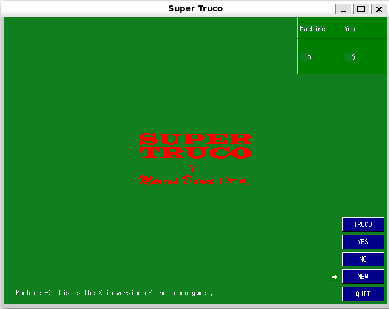

# XTRUCO

**XTRUCO** is a digital version of the classic card game **Truco**, implemented using **Xlib** for graphical interface on Unix-like systems.

## 🃏 About

I originally programmed **XTRUCO** when I was still a kid, on my **Apple II**.  
Later, I ported it to **C** and **Java** as a way to learn and experiment with different programming languages.  
This version is implemented using **Xlib**, for nostalgic and educational purposes.

## 🛠️ Requirements

To compile and run the project, you need:

- GCC (or any C compiler)
- X11 development libraries (`libx11-dev` on Debian/Ubuntu)
- A graphical environment with an active X server

## 🧪 Building

Use the following command to compile:

```bash
gcc -fdiagnostics-color=always -g xtruco.c -o xtruco -lX11 -lm
```

